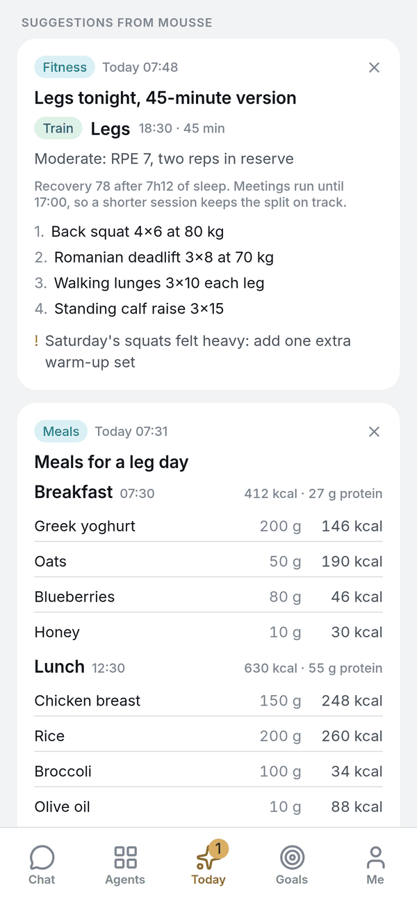
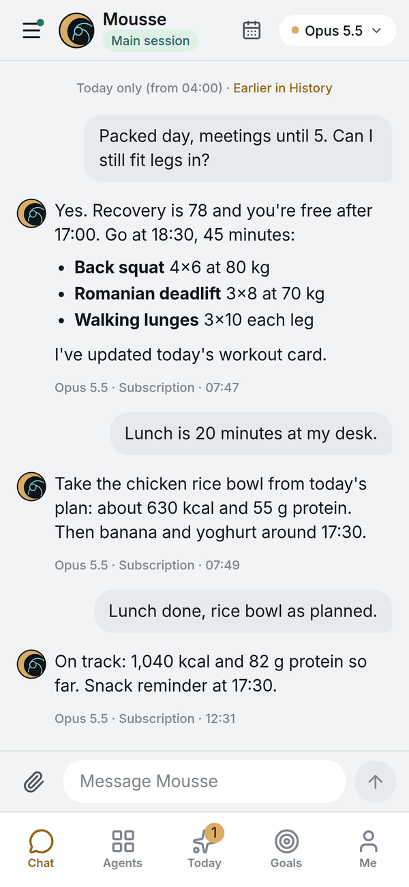

# OpenMousse

[中文](README.zh-CN.md) · **English** · [openmousse.ai](https://openmousse.ai)

**A personal-agent app for people who run [OpenClaw](https://github.com/openclaw/openclaw).** Chat with your agent from your phone, give each part of your life its own Agent, and keep one memory that Claude, ChatGPT, Gemini and your agent all share. Self-hosted: your machine, your model accounts, your data.

<p align="center">
  
  
  
</p>

- **Your agent in your pocket.** An iOS and web app for the OpenClaw you already run: streaming chat, voice notes, photos and files, push notifications.
- **One Agent per part of your life.** Fitness, meals, sleep, job applications… each is a real OpenClaw agent with its own memory, skills and dashboard. Ask for one in chat and it gets built.
- **It comes to you.** A morning report, suggestion cards that refresh when new data arrives, and a daily digest so every Agent remembers yesterday.
- **One memory for every AI.** The [memory tree](tree/) is an MCP server that Claude.ai, ChatGPT, Gemini and Notion connect to. It also works without OpenClaw.

**What's OpenClaw?** An open-source personal AI agent that runs on your own machine ([openclaw.ai](https://openclaw.ai)): skills, scheduled jobs, chat channels such as Telegram, any model. OpenMousse doesn't replace it; it adds an app, Agents and a shared memory on top.

**Not OpenMuse.** [CopilotKit's OpenMuse](https://github.com/CopilotKit/openmuse) is an agent *computer* (browser, terminal, email, forms) with its own agent built in. OpenMousse brings no agent of its own: it builds on your OpenClaw and focuses on your life data, proactive Agents and a memory every AI shares.

**Status: early.** The author uses it every day; installs on other machines are still being tried, so install reports are very welcome. The iPhone app's public TestFlight link comes after Apple's beta review.

### What leaves your machine

Conversations, memory and health data stay on your server. By design, these go out:

- messages to the model providers you configure in OpenClaw;
- push notifications through Expo and Apple (a title and a short preview);
- voice notes to the transcription service in `server.json` (OpenAI by default; point `transcribe_url` at your own Whisper server to keep them local);
- if you connect Claude.ai / ChatGPT / Gemini / Notion to the memory tree, they read and write it through the endpoint you expose.

More in the [privacy policy](https://openmousse.ai/privacy.html) and [SECURITY.md](SECURITY.md).

## Parts

| Directory | What it is | Status |
|---|---|---|
| [`tree/`](tree/) | The memory tree: one memory that Claude / ChatGPT / Gemini / Notion and your claw all attach to (over MCP). The app's "Memory" page is this | Usable (matured before the app) |
| [`app/`](app/) | iOS / Web client (Expo): chat, Agents, Today, Goals, Memory. Connects to your own server; you pick the name and icon | Usable (boards still assume the author's data sources, see packs) |
| [`server/`](server/) | Thin API layer (FastAPI): token auth, chat relay, Agent create / delete, board data, push, hosts the web build | Usable |
| [`packs/core/`](packs/core/) | What you get right after install: Agent-to-Agent handoff, creating Agents from chat, journal, the world-tree skill, the daily-close timer, and the installer itself | Usable |
| other `packs/` | Optional feature packs: fitness, diet, sleep, applications… each pack = one Agent's brief, tables, board cards, triggers | Being ported from Grava |

Design principles:

- **Blank slate.** After install there are no preset life domains. Say "I want to track sleep and weekly runs" and it creates an Agent for you. The author's own Agents ship as packs, to be used as templates.
- **Data sources are never locked in.** A pack only declares what data it needs (workouts, meals, sleep, body metrics), not where it comes from. Sources can be Apple Health, any health / fitness / diet app that exposes MCP, a small adapter script, or just telling the agent in chat. If the software you already use has MCP, plug it in; if not, write a tiny adapter.
- **Memory is the trunk.** The memory tree is not a side feature; it is the app's memory layer. Every platform and every Agent is a branch on the same tree.

## Install

Prerequisite: a Linux machine with OpenClaw installed and a model configured (`openclaw onboard` done, Gateway running). Then one command:

```bash
curl -fsSL https://raw.githubusercontent.com/openmousse/openmousse/main/install.sh | bash
```

It asks four questions (language, where OpenClaw lives, your timezone, what to call the assistant) and does the rest: clones the repo, installs Python dependencies into `~/.openmousse/venv`, writes `~/.openmousse/server.json`, generates a phone token, wires the [`packs/core`](packs/core/) skills and the daily-close timer into your OpenClaw (backing up `openclaw.json` first and validating afterwards), installs systemd services, and finally prints how to connect your phone. Running it again is safe: it only fills in what is missing.

Easiest if the machine is on Tailscale: the server binds to its Tailscale address and a phone with Tailscale can connect directly. Otherwise it listens on localhost only; expose it with `tailscale serve` or a reverse proxy as HTTPS.

After install you have a blank slate: no Agents, boards show "no data source yet". Say "make me an Agent for sleep" in chat and it builds one; log things in chat, or attach a data source (see packs).

## Two ways to get the app

**1. Install the author's TestFlight build** (fastest; public link coming after Apple's beta review): after install, the connection page asks for your server address and token. The assistant's name inside the app comes from your server (`app_name` in `server.json`); Agents you create yourself; data is your own. The home-screen icon and name were fixed at build time; to change those, use option 2.

**2. Build it yourself**: clone the repo, in `app/` copy `app.local.example.json` to `app.local.json` with your own name, bundle ids and Expo project, put your icons in `app/assets/local/`, then `eas build -p ios --profile production`. See [`app/README.md`](app/README.md).

The server side is the same either way: [`server/README.md`](server/README.md).

## Origin

OpenMousse was extracted from the author's personal system, Grava. Grava is the author's own instance; OpenMousse is the shell anyone can install.

## Contributing

See [CONTRIBUTING.md](CONTRIBUTING.md). Install reports and data-source adapters are the most useful things right now.

## License

MIT
