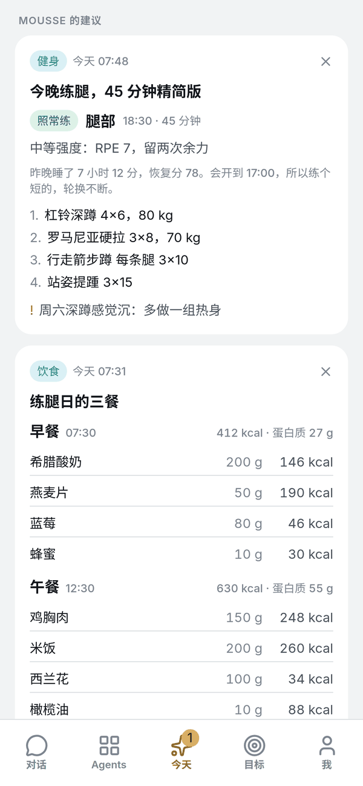
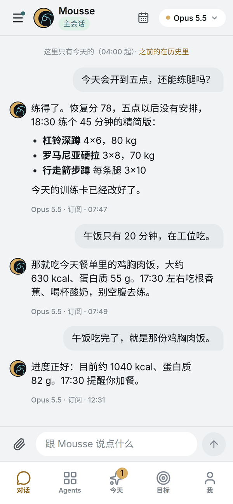
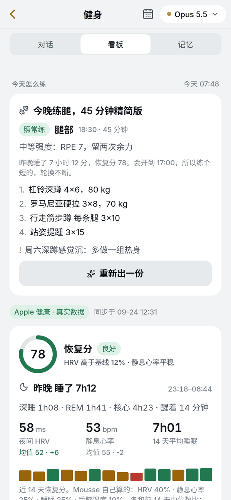

# OpenMousse

**中文** · [English](README.md) · [openmousse.ai](https://openmousse.ai)

**给自己跑 [OpenClaw](https://github.com/openclaw/openclaw) 的人的私人 agent app。** 在手机上直接跟你的 agent 对话，生活的每一块交给一个 Agent，再用一份记忆把 Claude、ChatGPT、Gemini 和你的 agent 串起来。自托管：你的机器、你的模型账号、你的数据。

<p align="center">
  <picture><source media="(prefers-color-scheme: dark)" srcset="docs/screenshots/zh-today-dark.png"></picture>
  <picture><source media="(prefers-color-scheme: dark)" srcset="docs/screenshots/zh-chat-dark.png"></picture>
  <picture><source media="(prefers-color-scheme: dark)" srcset="docs/screenshots/zh-fitness-dark.png"></picture>
</p>

- **口袋里的 agent。** 给你已经在跑的 OpenClaw 配一个 iOS 和网页 app：流式对话、语音输入、照片和文件、推送通知。
- **生活的每一块，一个 Agent。** 健身、饮食、睡眠、求职……每个都是真正的 OpenClaw agent，有自己的记忆、skills 和看板。在对话里说一句就建好。
- **它会主动找你。** 起床报告；新数据一到就更新的建议卡；每天的日结，让每个 Agent 记得昨天。
- **所有 AI 共用一份记忆。** [世界树](tree/)是一个 MCP 服务，Claude.ai、ChatGPT、Gemini、Notion 都能接。没有 OpenClaw 也能单独用。

**OpenClaw 是什么？** 跑在你自己机器上的开源个人 AI agent（[openclaw.ai](https://openclaw.ai)）：skills、定时任务、Telegram 之类的聊天渠道、任意模型。OpenMousse 不替代它，而是在它上面加一个 app、一组 Agents 和一份共享记忆。

**不是 OpenMuse。** [CopilotKit 的 OpenMuse](https://github.com/CopilotKit/openmuse) 是一台"agent 电脑"（浏览器、终端、邮件、填表），自带 agent。OpenMousse 不自带 agent：它建在你的 OpenClaw 上，专注你的生活数据、会主动找你的 Agents，和一份所有 AI 共用的记忆。

**状态：刚起步。** 作者每天在用；在别人机器上的安装还在试，非常欢迎安装反馈。iPhone app 的 TestFlight 公开链接等 Apple 的测试审核过了就放出来。

### 哪些数据会离开你的机器

对话、记忆和健康数据都留在你的服务器上。按设计会出去的只有：

- 发给你在 OpenClaw 里配置的模型服务商的消息；
- 经 Expo 和 Apple 的推送通知（标题和一段简短预览）；
- 语音发给 `server.json` 里配置的转写服务（默认 OpenAI；把 `transcribe_url` 指向你自己的 Whisper 服务就不出门）；
- 如果你把 Claude.ai / ChatGPT / Gemini / Notion 接到世界树，它们会通过你暴露的地址读写它。

详见[隐私政策](https://openmousse.ai/privacy.html)和 [SECURITY.md](SECURITY.md)。

## 组成

| 目录 | 是什么 | 状态 |
|---|---|---|
| [`tree/`](tree/) | 世界树：一份记忆，Claude / ChatGPT / Gemini / Notion 和你的 claw 都接到同一棵树上（MCP）。app 里的「记忆」页就是它 | 可用（先于 app 成型） |
| [`app/`](app/) | iOS / Web 客户端（Expo）：对话、Agents、今天、目标、记忆。连你自己的服务器，名字和图标你定 | 可用（看板部分仍绑作者的数据源，见 packs） |
| [`server/`](server/) | 薄 API 层（FastAPI）：令牌认证、对话转发、Agent 创建与删除、看板数据、推送、托管网页版 | 可用 |
| [`packs/core/`](packs/core/) | 装好就有的一层：Agent 之间的协作（handoff）、对话里建 Agent、日志、世界树 skill、日结定时器，以及安装器本体 | 可用 |
| `packs/` 其余 | 可选的功能包：健身、饮食、睡眠、求职……每个包 = 一个 Agent 的职责说明、数据表、看板卡片、触发器 | 从 Grava 移植中 |

设计原则：

- **白板**。装好后没有任何预设的生活领域，你对它说"我想跟踪睡眠和每周跑步"，它替你生成一个 Agent。作者自己的几个 Agent 以功能包形式提供，当模板用。
- **不锁死数据源**。功能包只声明它需要什么数据（训练、餐食、睡眠、身体指标），不规定数据从哪来。来源可以是 Apple 健康、任何提供 MCP 的健康 / 健身 / 饮食软件、一个适配器脚本，或者直接在对话里记。你已经在用的软件有 MCP 就能接，没有的写一个小适配器。
- **记忆是主体**。世界树不是附属功能，是 app 的记忆层；各平台和各 Agent 都是接到树上的枝。

## 装

前提：一台 Linux 机器，装好了 OpenClaw、配好了模型（`openclaw onboard` 跑过，Gateway 在跑）。然后一条命令：

```bash
curl -fsSL https://raw.githubusercontent.com/openmousse/openmousse/main/install.sh | bash
```

问四个问题（语言、OpenClaw 在哪、时区、助手叫什么），其余全做：clone 仓库、装 Python 依赖到 `~/.openmousse/venv`、写 `~/.openmousse/server.json`、生成手机令牌、把 [`packs/core`](packs/core/) 的 skills 和日结定时器接进你的 OpenClaw（改 `openclaw.json` 前备份、改完校验）、装成 systemd 服务，最后打印手机怎么连。再跑一遍是安全的，只补缺的。

机器在 Tailscale 里最省事：服务自动绑到 Tailscale 地址，手机装 Tailscale 就能连。不在的话服务只听本机，用 `tailscale serve` 或反向代理暴露成 HTTPS。

装完是一块白板：没有任何 Agent，看板显示「还没接数据」。在对话里说"帮我做一个管睡眠的 Agent"，它替你建；在对话里记录，或者接一个数据源（见 packs）。

## 两种用法

**1. 装作者发的 TestFlight**（最快）：装上后在连接页填你自己服务器的地址和令牌。app 内的助手名字来自你的服务器（`server.json` 的 `app_name`），Agent 你自己建，数据接你自己的。桌面图标和名字是打包时定的，想换要走第 2 种。

**2. 自己构建**：clone 仓库，`app/` 里复制 `app.local.example.json` 为 `app.local.json` 填自己的名字、包名、Expo 项目，把图标放进 `app/assets/local/`，然后 `eas build -p ios --profile production`。详见 [`app/README.zh-CN.md`](app/README.zh-CN.md)。

服务端两种用法都一样：[`server/README.zh-CN.md`](server/README.zh-CN.md)。

## 出处

OpenMousse 从作者的个人系统 Grava 抽出来。Grava 是作者自己的实例，OpenMousse 是任何人都能装的壳。

## 参与

见 [CONTRIBUTING.zh-CN.md](CONTRIBUTING.zh-CN.md)。现在最有用的是安装报告和数据源适配器。

## 许可

MIT
